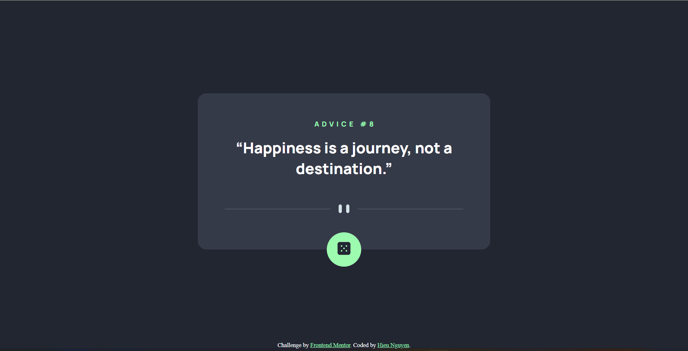
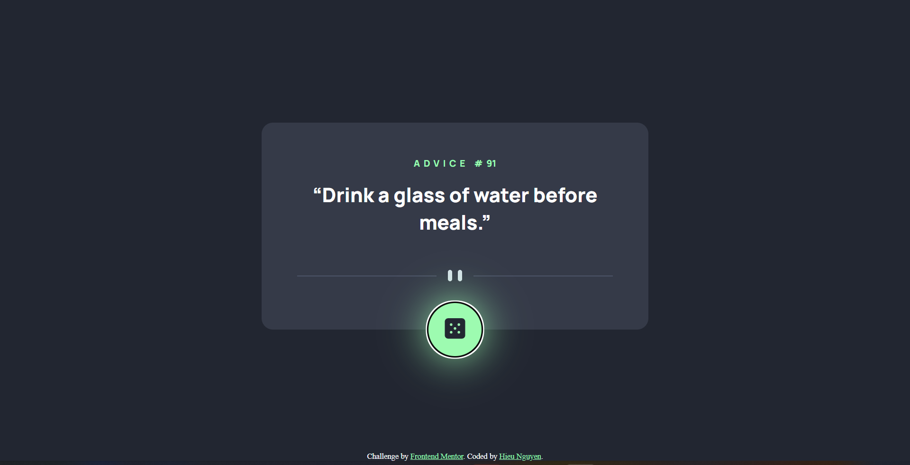
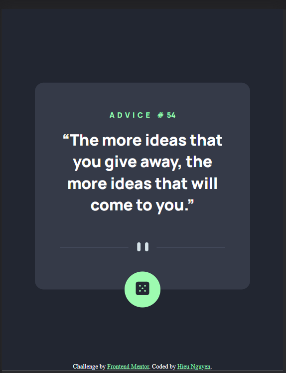
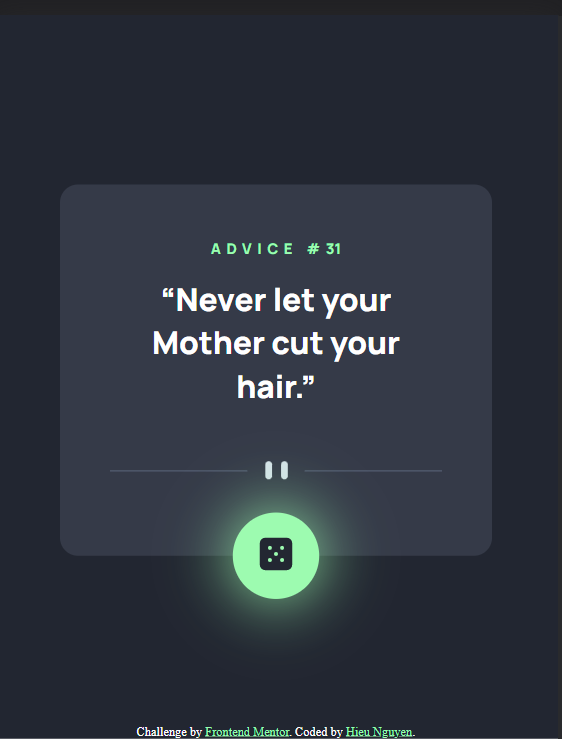

# Frontend Mentor - Advice generator app solution

This is a solution to the [Advice generator app challenge on Frontend Mentor](https://www.frontendmentor.io/challenges/advice-generator-app-QdUG-13db). 

## Table of contents

- [Overview](#overview)
  - [The challenge](#the-challenge)
  - [Screenshot](#screenshot)
  - [Links](#links)
- [My process](#my-process)
  - [Built with](#built-with)
  - [What I learned](#what-i-learned)
  - [Continued development](#continued-development)
- [Author](#author)

## Overview

### The challenge

Users should be able to:

- View the optimal layout for the app depending on their device's screen size
- See hover and active states for the dice icon on the page
- Generate a new piece of advice by clicking the dice icon

### Screenshot

- In desktop screen size

- In desktop screen size with active states

- In mobile screen size

- In mobile screen size with active states

### Links

- Solution URL: [Add solution URL here](https://github.com/BeingX234/Advice-generator-app)
- Live Site URL: [Add live site URL here](https://beingx234.github.io/Advice-generator-app/)

## My process

### Built with

- Semantic HTML5 markup
- CSS custom properties
- Transition and transform properties (To make it more cooler! I guess?)
- Flexbox
- Simple fetching data from API function

### What I learned

- Learned how to use Javascript for fetching data from API.

- Learned about the basics of transition and transform in CSS.

### Continued development

- Maybe this is just a simple project but I did the best I could do (atleast for now). It's fun to know more about Javascript and the transition/transformation in CSS. There are still a lot of things I need to learn more, especially the Javascript and sure I will have to remember more HTML tags and CSS properties (still needed to google a lot when coding)

## Author

- Website - [BeingX234 or Hieu Nguyen](https://github.com/BeingX234)
- Frontend Mentor - [@BeingX234](https://www.frontendmentor.io/profile/BeingX234)

